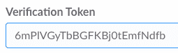

# Connecting Salesforce to Slack through Tray 📖

Instantly notify a team of a new sales lead with a `Slack notification` whenever an opportunity is created within `Salesforce`. Utilizing the `Salesforce webhook connector` or `configured webhook trigger`, send new opportunity account data to a workflow on the Tray platform immediately after a sales rep submits the information. 

Using the `branch operator`, will evaluate the account country (`US`, `EU`, `UK`). Then update necessary key values from the Salesforce output with an `object helper`. Map the updated account data returned by the `object helper` to the `Slack connector` to create a notification that will be sent to the appropriate sales channel base on the account country.
<div align="center">
  
  <br/>
  <span style="font-size: 14px;font-style: italic;color: #9B9B9B">The Slack notification workflow that will be setup through this documentation.</span>
</div>
<br/>

----

### Requirements:
  * A Slack account with admin permissions
  * A tray.io account (you can sign up [here](https://app.tray.io/login))
  
----


## (1) Slack Application Setup 🤖

A Slack application will need to be created in order for a Tray workflow to send Slack notifications. This can be found in Tray's Slack service documentation, in steps 1-3, under the `Setting up your private Slack app` section:
[https://tray.io/documentation/platform/connectors/docs/service/slack/#setting-up-your-private-slack-app](https://tray.io/documentation/platform/connectors/docs/service/slack/#setting-up-your-private-slack-app)

Once the application is created be sure to click `Basic Information`, and copy the `Verification Token`. The token is required when using a connector within a Tray workflow and will be needed later in the [`Send a notification`](https://amberlburroughs.github.io/Tray-Document-demo/#send-a-notification-) section.
<div align="center">
  
  <br/>
  <span style="font-size: 14px;font-style: italic;color: #9B9B9B">Example Slack authentication token</span>
</div>
<br/>

## (2) Create a Tray workflow 🔀
Navigate to the Tray dashboard and select create new workflow. The button will look similar to the one below:

<div align="center">
  
  <br/>
  <span style="font-size: 14px;font-style: italic;color: #9B9B9B">Example workflow button</span>
</div>
<br/>

### (3) Add a trigger 💥
The workflow trigger that's used will depend on the Salesforce account edition:
  * Salesforce `Enterprise Edition` users have access to the `Salesforce connector trigger` in Tray, which has direct access to webhooks.
  * Salesforce `Professional Edition` users will need to use the `webhook trigger` in Tray, configured to their Salesforce account.

Read about user permissions in Tray's documentation under the `user permissions section`: [https://tray.io/documentation/platform/connectors/docs/service/salesforce/correct-setup-of-user-permissions](https://tray.io/documentation/platform/connectors/docs/service/salesforce/correct-setup-of-user-permissions)

Once the connector is authorized, a sales rep can create a new opportunity within Salesforce. This will trigger the webhook and the new account data will be sent over to the Tray workflow. The output from the webhook will be referenced in the following step of the work flow [`Conditional Branching`](https://github.com/AmberLBurroughs/Tray-Document-demo/blob/master/README.md#conditional-branching):

```
  {
        "id": "0065800000BwzJt",
        "name": "Sample02",
        "status": "Qualification",
        "account": "Andrew Test",
        "close_date": "2017-03-16",
        "type": "New Business",
        "country": "UK", // can also be US or EU
        "owner_name": "Andrew",
        "owner_email": "andrew@tray.io",
        "amount": 4500
    }
```
<div align="center">
 <span style="font-size: 14px;font-style: italic;color: #9B9B9B">Salesforce trigger output example</span>
</div>
<br/>
    
### (4) Conditional Branching 🌳
The account data output from Salesforce will have 1 of 3 country codes in the `country` attribute:
* "US" 🇺🇸
* "UK" 🇬🇧
* "EU" 🇪🇺

The `branch connector` allows each of the country values to be compared against the account's country attribute. The account country is selected from the Salesforce output using the `Connector Snake`, or by changing the input type to JSON Path and typing a reference to the output data. The matching branch is then followed and a method is performed on the account data output from Salesforce. 

### (5) Object Helper 💁
The Object Helper enables the ability to interact with the account data object. The account data is selected from the Salesforce output using the `Connector Snake` or by changing the input type to JSON Path and typing a reference to the output data. 

Two operations are used on the account data output using the object helper:
  * `Add key/value pairs`
  * `Add value by key`

##### (5.1) Add key/value pairs
This operation is used to create a new key of `channel` on the object, with the destination slack channel as the value.
  * "US" 🇺🇸 -  "#sales-us"
  * "UK" 🇬🇧 - "#sales-uk"
  * "EU" 🇪🇺 - "#sales-eu"
  
 It is also used to create a new key `pretext` which has the value "opportunity created with status ${account.status}" and another key named `color` with the value "#35A64F" (i.e. green, to denote a new opportunity).

##### (5.2) Add value by key
This operation is used to create a friendly value to the key `display_amount` which adds the branch specific currency symbol.
  * "US" 🇺🇸 -  "$${account.status}"
  * "UK" 🇬🇧 - "£${account.status}"
  * "EU" 🇪🇺 - "€${account.status}"
  
Read the more about object helpers and view the full operations reference in Tray's documentation: [https://tray.io/documentation/platform/connectors/docs/helpers/object-helper/](https://tray.io/documentation/platform/connectors/docs/helpers/object-helper/)

### (6) Send a notification 🔔
The output from the object helper is then mapped over using the `Data Mapper` service. This ensures that the output from the helper is automatically passed to Tray's Slack service connector in the format needed.

Now that all of the account data has been setup within Tray, it can be sent over to the appropriate Slack channel as a message.

The Tray `Slack Connector` will be added and configured with the verification token that was referenced in the [slack application setup](https://amberlburroughs.github.io/Tray-Document-demo/#slack-application-setup-) step above. 

Once the verification taken is entered, select the `Send Message` operation. For this message, the workflow will be sending it as a single attachment in Slack with several fields.

Each selected slack field property is filled with the output data using the Connector Snake or by changing the input type to JSON Path and typing a reference to the output data.

Here's an example of what some JSON data might look like, as it is sent over to the #sales-uk channel:
```
    {
        token: "6mPIVGyTbBGFKBjOtEmfNdfb",
        channel: helperObject.channel,
        attachments:[
            color: helperObject.color,
            pretext: helperObject.pretext,
            fields: [
                {
                    "title": "Opportunity Name",
                    "value": helperObject.name,
                    "short": false
                },
                {
                    "title": "Account Name",
                    "value": helperObject.account,
                    "short": false
                },
                {
                    "title": "Close Date",
                    "value": helperObject.close_date,
                    "short": false
                },
                 {
                    "title": "Amount",
                    "value": helperObject.display_amount,
                    "short": false
                },
                 {
                    "title": "Type",
                    "value": helperObject.type,
                    "short": false
                },
                 {
                    "title": "Owner",
                    "value": helperObject.owner_name,
                    "short": false
                }
            ],
            "footer": "Sent via tray.io"
        ]
     }
```

Referencing the sample webhook data we started with, here's what that JSON data would look like, as it is sent over to the Slack API via Tray:
```
    {
        token: "6mPIVGyTbBGFKBjOtEmfNdfb",
        channel: "sales-uk",
        attachments:[
            color: "#35A64F",
            pretext: "opportunity created with status Qualification",
            fields: [
                {
                    "title": "Opportunity Name",
                    "value": "Sample02",
                    "short": false
                },
                {
                    "title": "Account Name",
                    "value": "Andrew Test",
                    "short": false
                },
                {
                    "title": "Close Date",
                    "value": "2017-03-16",
                    "short": false
                },
                 {
                    "title": "Amount",
                    "value": "£4500",
                    "short": false
                },
                 {
                    "title": "Type",
                    "value": "New Business",
                    "short": false
                },
                 {
                    "title": "Owner",
                    "value": "Andrew",
                    "short": false
                }
            ],
            "footer": "Sent via tray.io"
        ]
     }
```
<div align="center">
 <span style="font-size: 14px;font-style: italic;color: #9B9B9B">Slack request example</span>
</div>
 <br/>
 
 ### (7) Verifying everything works 👍
 
 With the workflow setup, we can now test it to ensure that everything is working and that alerts are properly being sent over to Slack. We can do this by creating a new opportunity in Salesforce. Once it is created, you should see a similar notification in the respective Slack channel:
 

 <div align="center">
 
  <br/>
 <span style="font-size: 14px;font-style: italic;color: #9B9B9B">Slack notification example</span>
</div>
 <br/>

## (8) Additional resources 🌟

A high level overview of Tray's platform: [https://tray.io/documentation/platform/overview/](https://tray.io/documentation/platform/overview/)

A simple web form to Slack workflow: [https://tray.io/documentation/platform/getting-started/simple-slack-workflow/](https://tray.io/documentation/platform/getting-started/simple-slack-workflow/)

 General overview of Tray's Salesforce service: [https://tray.io/documentation/platform/connectors/docs/service/salesforce/](https://tray.io/documentation/platform/connectors/docs/service/salesforce/)
 
 Details on how webhook trigger works:[https://tray.io/documentation/platform/connectors/webhook-trigger/](https://tray.io/documentation/platform/connectors/webhook-trigger/)

Workflow / Slack service reference: 
[https://tray.io/documentation/platform/connectors/docs/service/slack/](https://tray.io/documentation/platform/connectors/docs/service/slack/)


Boolean and branch conditions: [https://tray.io/documentation/platform/connectors/docs/core/boolean-condition/](https://tray.io/documentation/platform/connectors/docs/core/boolean-condition/)

Conditional logic: [https://tray.io/documentation/platform/advanced-tray-usage/conditional-logic/](https://tray.io/documentation/platform/advanced-tray-usage/conditional-logic/)

Connector snake: [https://tray.io/documentation/platform/working-with-data/basic-data-guide/](https://tray.io/documentation/platform/working-with-data/basic-data-guide/)

Data Mapper: [https://tray.io/documentation/platform/connectors/docs/core/data-mapper/](https://tray.io/documentation/platform/connectors/docs/core/data-mapper/)

Slack documentation, which Tray's Slack service interfaces with / acts as a wrapper for:
- chat.postMessage() function: [https://api.slack.com/methods/chat.postMessage](https://api.slack.com/methods/chat.postMessage)
- Message attachments: [https://api.slack.com/docs/message-attachments](https://api.slack.com/docs/message-attachments)
- Workspace tokens: [https://api.slack.com/methods/workspace-tokens/#chat](https://api.slack.com/methods/workspace-tokens/#chat)


## (9) Design choices and considerations

There are multiple ways to implement this in a Tray workflow. I designed the workflow like this, because it simplifies the amount of setup work needed to send a Slack notification to a channel. 

Alternatively, it's possible to move the Slack notification action and set one up for each individual branch, though it would only be recommended if the user wants to implement additional actions per-country once the ontification has been sent.

Without access to the Tray platform, a lot of this is a generally high level overview and involved some guess work on my end. Provided proper support access to Salesforce and Tray, I would provide much more specific details on navigating pages, specific attributes, and providing screenshots showing more definitive examples of how a user would setup actions in a workflow.
